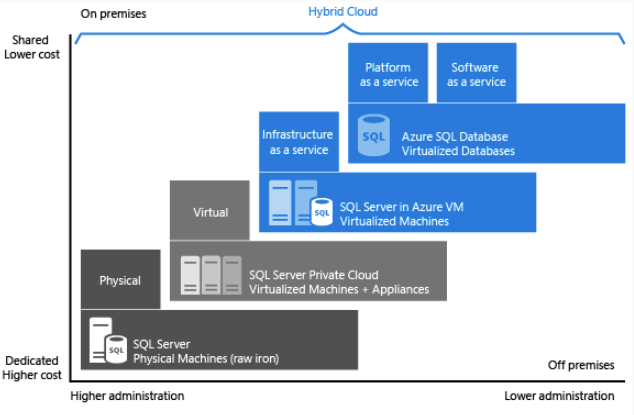

# Deploy PaaS solutions with Azure SQL

 Learning objectives

After completing this module, you will be able to:

- Gain an understanding SQL Server in a Platform as a Service (PaaS) offering
- Understand PaaS provisioning and deployment options
- Understand elastic pools
- Examine Azure SQL Managed Instances
- Explore Azure SQL Edge
- Configure a template for PaaS deployment

## 1. Introducción

- Azure SQL Database, 
- Azure SQL managed instances and 
- Azure SQL Edge,

Learning objectives

At the end of this module, you'll be able to:

- Understand PaaS provisioning and deployment options
- Understand elastic pools and hyperscale features
- Examine SQL Managed Instances
- Understand SQL Edge

## 2. Explain PaaS options for deploying SQL Server in Azure

- PaaS: plataforma como servicio

1. **Azure SQL Database** – Part of a family of products built upon the SQL Server engine, in the cloud. It gives developers a great deal of flexibility in building new application services, and granular deployment options at scale. SQL Database offers a low maintenance solution that can be a great option for certain workloads.

2. **Azure SQL Managed Instance**– It is best for most migration scenarios to the cloud as it provides fully managed services and capabilities

Deployment models

Azure SQL Database is available in two different deployment models:

- **Single database** – a single database that is billed and managed on a per database level. You manage each of your databases individually from scale and data size perspectives. Each database deployed in this model has its own dedicated resources, even if deployed to the same logical server.

- **Elastic Pools** – a group of databases that are managed together and share a common set of resources. Elastic pools provide a cost-effective solution for software as a service application model, since resources are shared between all databases. You can configure resources based either on the DTU-based purchasing model or the vCore-based purchasing model.

### Modelos de compra

1. **Database Transaction Unit (DTU)**

DTUs are calculated based on a formula combining compute, storage, and I/O resources. It is a good choice for customers who want simple, preconfigured resource options.

The DTU purchasing model comes in several different service tiers, such as Basic, Standard and Premium. Each tier has varying capabilities, which provide a wide range of options when choosing this platform. **DTU purchasing model is only supported by Azure SQL Database.**

2. **vCore**

The vCore model allows you to purchase a specified number of vCores based on your given workloads. vCore is the default purchasing model when purchasing Azure SQL Database resources. vCore databases have a specific relationship between the number of cores and the amount of memory and storage provided to the database. vCore purchasing model is supported by either Azure SQL Database and Azure SQL Managed Instance.

You can purchase vCore databases in three different service tiers as well:

- **General Purpose** – This tier is for general purpose workloads. It is backed by Azure premium storage. It will have higher latency than Business Critical. It also provides the following compute tiers:

    - **Provisioned** – Compute resources are pre-allocated. Billed per hour based on vCores configured.
    - **Serverless** – Compute resources are auto-scaled. Billed per second based on vCores used.

- **Business Critical** – This tier is for high performing workloads offering the lowest latency of either service tier. This tier is backed by local SSDs instead of Azure blob storage. It also offers the highest resilience to failure as well as providing a built-in read-only database replica that can be used to off-load reporting workloads.

- **Hyperscale** – Hyperscale databases can scale far beyond the 4 TB limit the other Azure SQL Database offerings and have a unique architecture that supports databases of up to 100 TB

