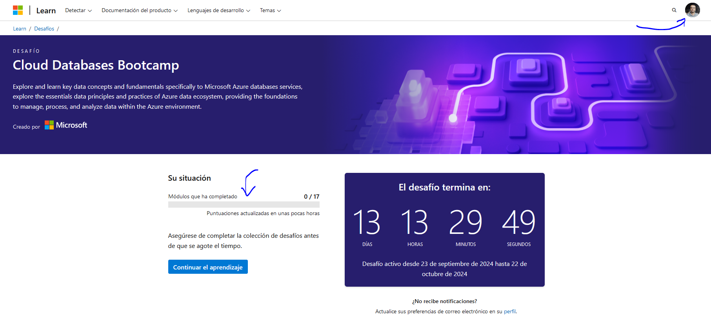

# Deploy PaaS solutions with Azure SQL

https://learn.microsoft.com/es-mx/training/

 
Learning objectives

After completing this module, you will be able to:

- Gain an understanding SQL Server in a Platform as a Service (PaaS) offering
- Understand PaaS provisioning and deployment options
- Understand elastic pools
- Examine Azure SQL Managed Instances
- Explore Azure SQL Edge
- Configure a template for PaaS deployment

## 1. Introducción

- Azure SQL Database, 
- Azure SQL managed instances and 
- Azure SQL Edge,

Learning objectives

At the end of this module, you'll be able to:

- Understand PaaS provisioning and deployment options
- Understand elastic pools and hyperscale features
- Examine SQL Managed Instances
- Understand SQL Edge

## 2. Explain PaaS options for deploying SQL Server in Azure

- PaaS: plataforma como servicio

1. **Azure SQL Database** – parte de una familia de productos creados sobre el motor de SQL Server, en la nube. Proporciona a los desarrolladores una gran flexibilidad para crear servicios de aplicación y opciones de implementación granulares a gran escala. SQL Database ofrece una solución de bajo mantenimiento que puede ser una excelente opción para determinadas cargas de trabajo.

2. **Azure SQL Managed Instance**– es mejor para la mayoría de los escenarios de migración a la nube, ya que proporciona servicios y funcionalidades totalmente administrados.

Deployment models

Azure SQL Database is available in two different deployment models:

- **Single database** – una base de datos única que se factura y administra por nivel de base de datos. Cada una de las bases de datos se administra individualmente desde perspectivas de escala y tamaño de datos. Cada base de datos implementada en este modelo tiene sus propios recursos dedicados, incluso si se implementa en el mismo servidor lógico.

- **Elastic Pools** – un grupo de bases de datos que se administran juntas y comparten un conjunto común de recursos. Los grupos elásticos proporcionan una solución rentable para el modelo de aplicación de software como servicio, ya que los recursos se comparten entre todas las bases de datos. Puede configurar recursos basados en el modelo de compra basado en DTU o en el modelo de compra basado en núcleo virtual.

### Modelos de compra

1. **Database Transaction Unit (DTU)**

Las DTU se calculan en función de una fórmula que combina el proceso, el almacenamiento y los recursos de E/S. Es una buena opción para los clientes que quieren disponer de opciones de recursos sencillas y configuradas previamente.

El modelo de compra de DTU viene en varios niveles de servicio diferentes: Básico, Estándar y Premium. Cada nivel tiene funcionalidades distintas, que proporcionan una amplia gama de opciones al elegir esta plataforma.

> [!NOTE]
> El modelo de compra de DTU solo es compatible con Azure SQL Database.

2. **vCore**

The vCore model allows you to purchase a specified number of vCores based on your given workloads. vCore is the default purchasing model when purchasing Azure SQL Database resources. vCore databases have a specific relationship between the number of cores and the amount of memory and storage provided to the database. vCore purchasing model is supported by either Azure SQL Database and Azure SQL Managed Instance.

You can purchase vCore databases in three different service tiers as well:

- **General Purpose** – This tier is for general purpose workloads. It is backed by Azure premium storage. It will have higher latency than Business Critical. It also provides the following compute tiers:

    - **Provisioned** – Compute resources are pre-allocated. Billed per hour based on vCores configured.
    - **Serverless** – Compute resources are auto-scaled. Billed per second based on vCores used.

- **Business Critical** – This tier is for high performing workloads offering the lowest latency of either service tier. This tier is backed by local SSDs instead of Azure blob storage. It also offers the highest resilience to failure as well as providing a built-in read-only database replica that can be used to off-load reporting workloads.

- **Hyperscale** – Hyperscale databases can scale far beyond the 4 TB limit the other Azure SQL Database offerings and have a unique architecture that supports databases of up to 100 TB

