# Fundamentos

## Objetivos:

- preparación para la certificación DP-900
- fundamentos de bases de datos en la nube
- datos, conceptos básicos, formatos
- roles
- servicios
- carga de trabajo

## Recomendaciones:

- La Dp-900 es mas teórica que practica.
- Pocos ejercicios

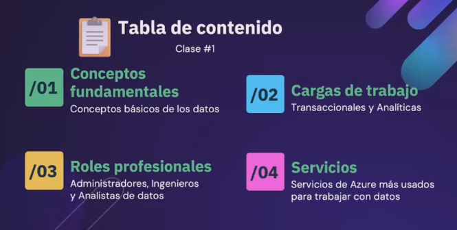

## 1. Conceptos Fundamentales

### - ¿Qué son los datos?: valores usados para registrar información, a menudo se representa en entidades

- alimentan a los dispositivos
- datos de IoT
- para tomar decisiones
- ver tendencias,
- usados en la IA

### Clasificaciones:

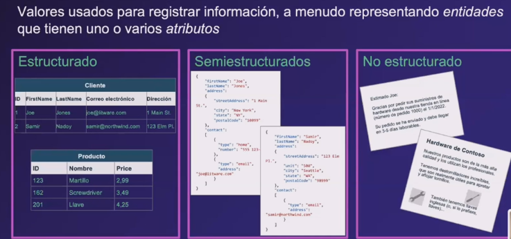

#### 1. Estructurados: se define un esquema fijo, filas y columnas, son estrictos

- se aplican políticas, null: ausencia de valor
- si se tienen que agregar nuevas columnas, entonces los registros viejos deben tener un valor por defecto para que no queden vacíos ya que si no se hace se incumple lo estructurado.
- se pueden **relacionar** las tablas o entidades.
- ejemplo bases de datos relacionales, sql server, oracle, postgresl
- los datos están de manera lineal

#### 2. Semiestructurados

- existe cierta estructura
- pero se permite ser flexible
- pueden existir atributos que no siempre están en todos los datos,
- se puede pensar en esta forma cuando los datos pueden tener muchos valores nulos
- existe una jerarquía, es decir registros con sub-registros
- en este caso para relacionar una entidad con otra se usan las **referencias**, por ejemplo para no duplicar los datos, igual existen otras estrategias
- ejemplos una tabla de productos, una camisa con un arroz, son productos pero el arroz tiene datos que la camisa no necesariamente

    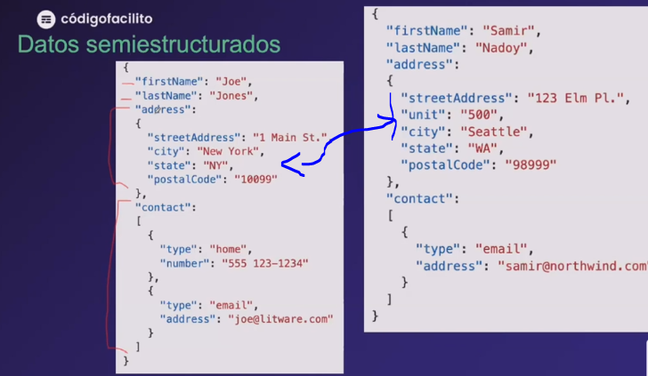

#### 3. No estructurados

- no tienen esquema ni estructura
- se ve como un todo
- ejemplos: archivos binarios, pdfs, fotos, video, audio, word, archivos, emails
- se puede usar IA para sacar datos de estas entidades.

    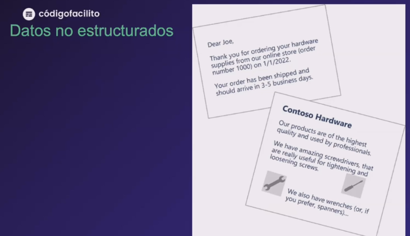

### ¿Cómo se almacenan los datos?: en almacenes, cada uno de ellos tiene ventajas y desventajas que los hacen útiles en ciertos casos de uso

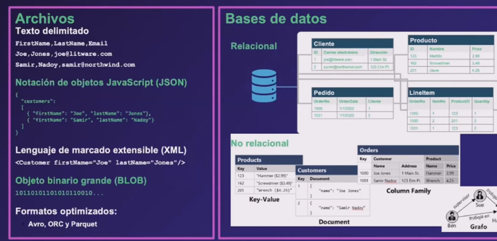

#### En **archivos**

- de **texto delimitado**, con formato ejemplo csv texto delimitado, su razón es para poder leer los datos con mayor facilidad. la coma dice la separación de los datos.
- en texto dependiendo del caso se puede usar otro carácter para separar o delimitar, esto si por ejemplo la coma puede ser un dato entonces se puede usar °, | o cualquier carácter que sepamos que no va a formar parte del dato en si.
- en archivos **JSON**= notación de objetos javascript: existen jerarquía de datos, colecciones, cada atributo puede ser también un objeto. usado en muchos sistemas, antes se usaba xml. 
- en formato **xml** es un lenguaje de marcado. tiene mas tamaño que el json por la apertura y cierre de las etiquetas.
- en archivos **binarios** o BLOB, ejemplo un pdf, en sql se permite guardar en formato blob
- en formatos optimizados como **Avro, ORC, Parquet**, 
- **AVRO**: formato basado en filas creado por apache, es similar a json, pero existen metadatos como encabezados, estos encabezados definen la estructura de los datos, aunque su formato es un json su contenido es binario. 
- **ORC**: organiza los datos en columnas, en vez de filas
- **Parquet**: parecido a ORC pero tiene mas funciones, se usa por ejemplo con **spark**, en analítica, su estructura permite encontrar datos de manera rapida en volúmenes muy grandes de datos.

    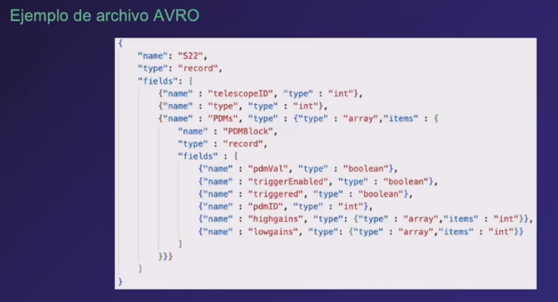

    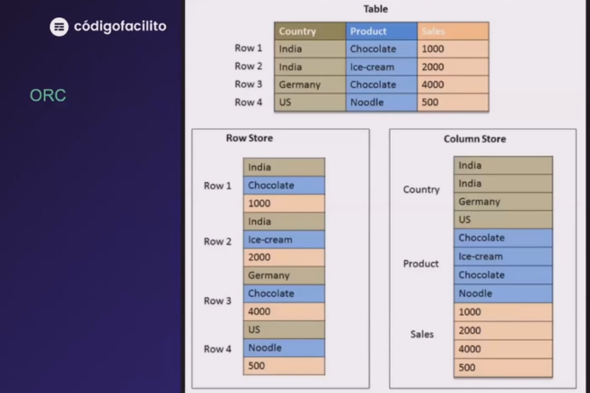

    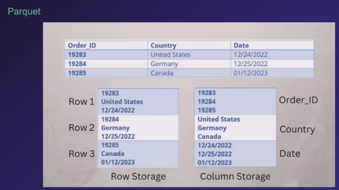

#### En **bases de datos**

##### - **BD relacional** es un sistema, que sirve para almacenar y consultar, editar, eliminar los datos.

- manejo ágil y optimo de los datos
- los datos se almacenan en un archivo gestionado por el motor del sistema de base de datos.
- es un método profesional para almacenar datos
- no siempre se recomienda usar una base de datos para guardar los datos, es necesario revisar el caso de uso y sus implicaciones.
- las relacionales almacena datos de manera estructurada.
- ahora en **sql server** se permite guardar datos tipo json, en donde la columna ya no es varchar sino tipo json que esta optimizada para este tipo de dato.
- al existir un dato tipo json aceptado por la base de datos se hace mas fácil buscar un dato ya que no es necesario crear programación para barrerlos o explorar el varchar que antes representaba el json.
- las entidades se pueden relacionar

    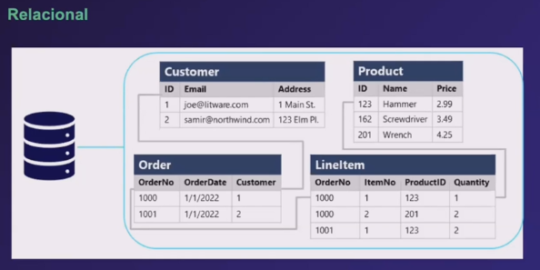

##### - **BD No relacional**, se guardan los datos semi estructurados

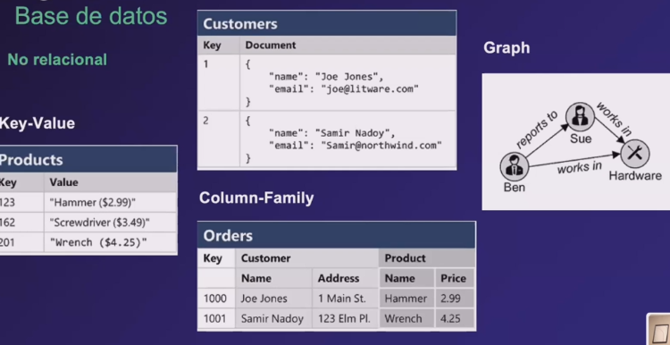

- **llave - valor**
- **documento** : cadenas llave-valor, pero el valor esta en formato json
- **column-family** : parecido al relacional, pero cada columna puede agrupar mas de un dato o datos. hay columnas y sub columnas, por eso familia de columnas, se relacionan de alguna manera.
- **graph**: se representa de manera gráfica, responde preguntas, la información se guarda como nodos, nodos que están vinculados con otros elementos o nodos ejemplo **neo4j**

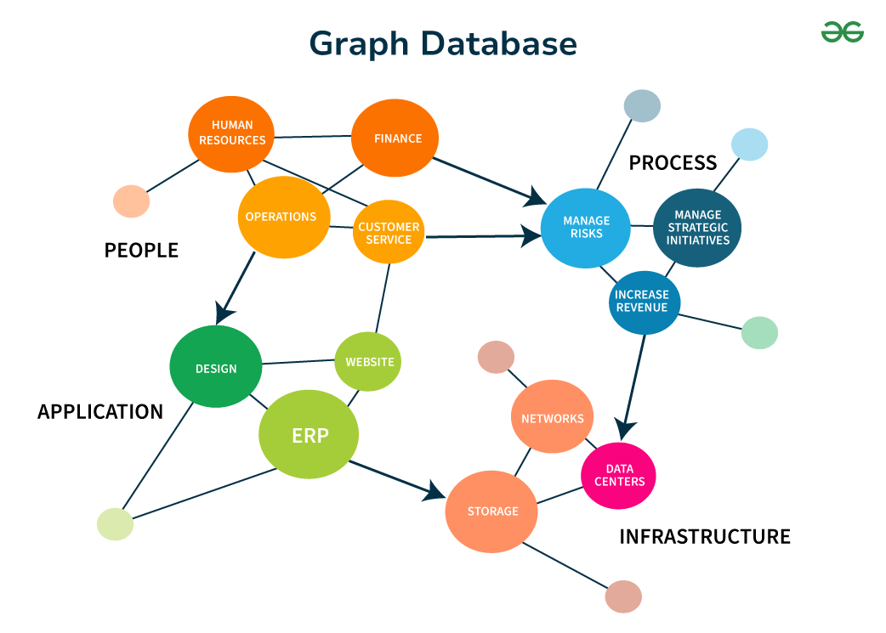

## 2.  Cargas de Trabajo (transaccionales y analíticas)

### 1. Transaccional / operativo

- se deben cumplir todos los pasos para que se cumpla la transacción.

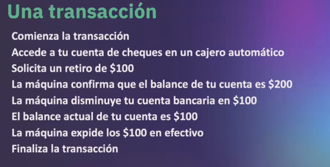

- Se basan en ACID, no se pueden procesar datos parciales o incompletos.
    - A: **Atomicidad**: cada transacción se trata como una unidad única de trabajo, se completa toda la transacción o se produce un error. o todo funciona o todo falla
    - C: **Coherencia**: la transacción puede pasar los datos de un estado valido a otro tambien valido
    - I: **Aislamiento**: las transacciones simultaneas no pueden interferir entre si, entran en cola o se niega una de las transacciones.
    - D: **Durabilidad**: cuando a transacción se ha realizado con éxito los cambios se conservan en la BD, cerrando con un **commit** que es una confirmación.
- OLTP: la bd esta optimizada para operaciones transaccionales en linea que admite operaciones de lectura y escritura, 
- los datos se almacenan mediante transacciones
- Ejemplos: 
    1. retiro de una cuenta bancaria
    2. compras en linea
    3. registro de información de sensores
    4. confirmar la compra de verduras que te encargó tu mama.

### 2. Analíticas

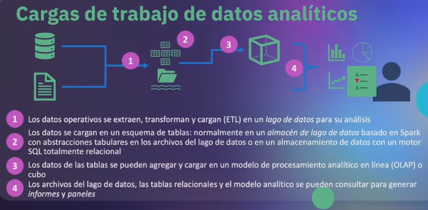

- ETL: extraer, transformar y cargar, incluye la limpieza de los datos
- Se usa con grandes cantidades de datos. o escala alta.
- Se usa para analizar
- Datawherehouse o almacén de datos o bodega de datos en Microsoft le llaman almacén de datos
- Los datos se guardan en sistemas de datos que están optimizados para lecturas.
- lectura y creación reportes, agrupar.
- se usan los cubos de datos
- ejemplo: **colab** procesamientos de datos en linea.

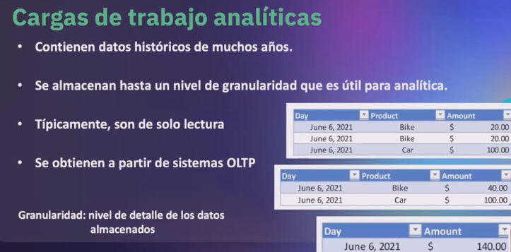

- **Granularidad**: se refiere al nivel de detalle, por ejemplo:
    - ventas de un día
    - ventas de un día de un articulo en especifico
    - cuantas operaciones de bicicletas y de carros

- Evaluación 1
    
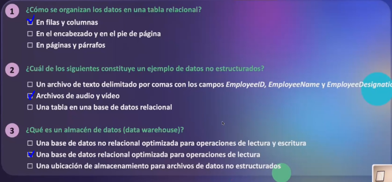

## 3. Roles Profesionales 

- **Administradores**
- **Ingenieros**
- **Analistas de datos**
- Científicos de datos
- Arquitecto de datos
- Gobernanza de datos
- Existen otros roles.

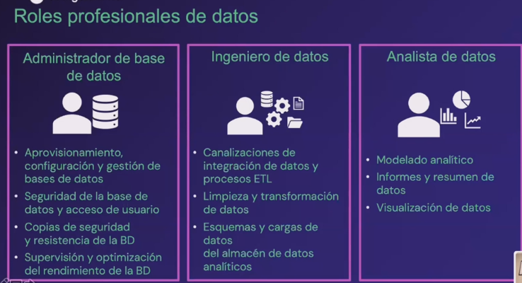

**Administrador de bases de datos**

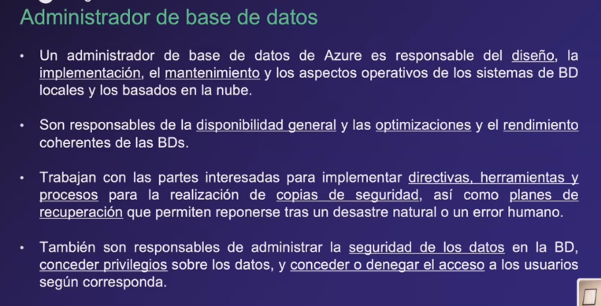

**Ingeniero de datos**

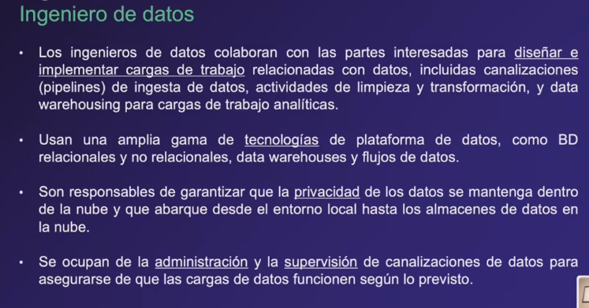

**Analista de Datos**

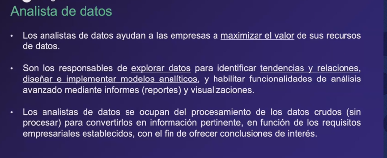

## 4. Servicios (Servicios de Azure mas usados para trabajar con datos)

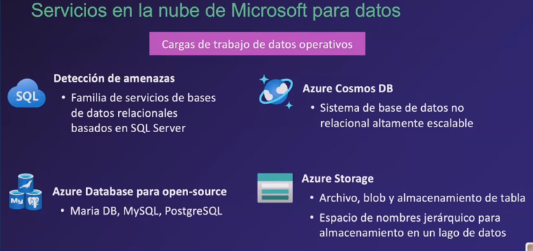

### **Datos Operativos o transaccionales**

- Azure SQL
- SQL en una maquina virtual, llamada instancia administrada
- MySQL, MariaB, Postgresql (opensource)
- Azure Cosmo DB con MongoDB, acceso a 4 APIS, 
- Azure Store: archivos y tablas

### **Datos Analiticos**

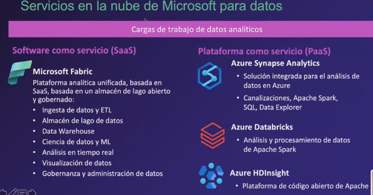

cuestionario # 2

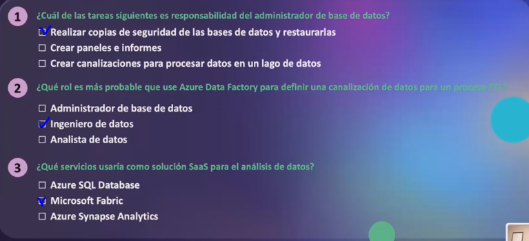

EXTRA:

**BD no relacionales**

- la IA generativa usa los datos por ejemplo de mongoDB
- vectorización, significado para poder hacer búsquedas semánticas en un texto, una imagen un archivo
- IA tiene relación con científico de datos.
