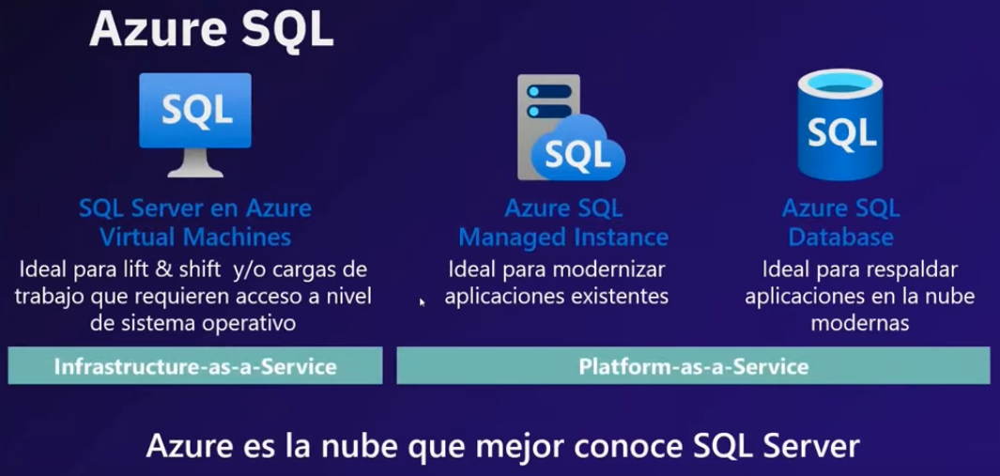
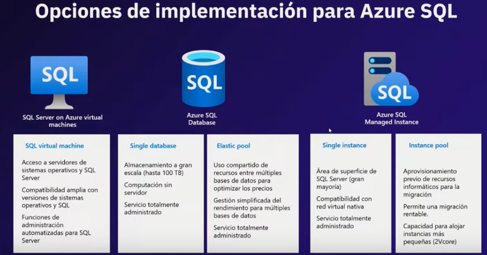
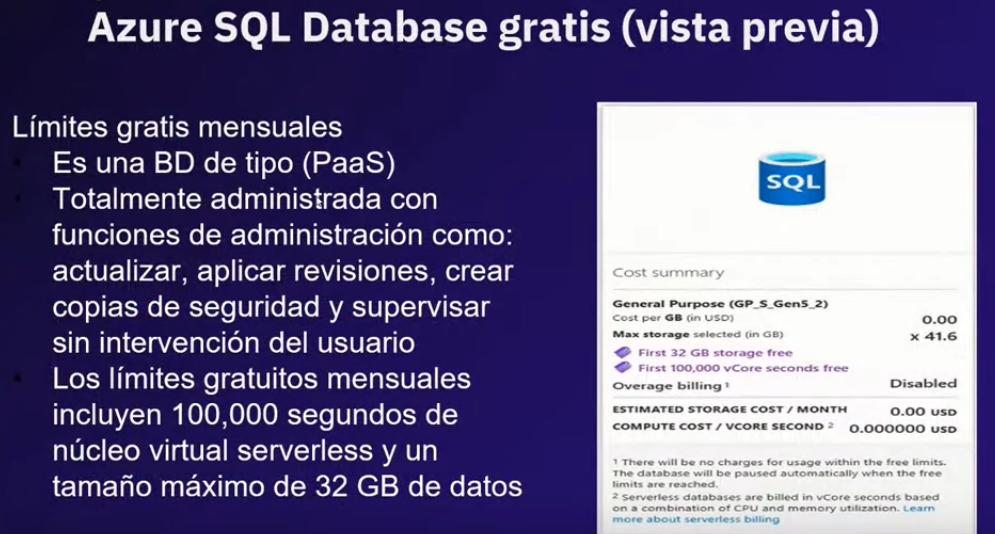

# Fundamentos de datos relacionales (SQL) y no relacionales (NoSQL)

https://www.youtube.com/live/Ggm1jShp1Eg

Instructor: Dr. Jesus Gil Dr Rudo SQL
Autor de guías oficiales: SQL Server 2012 Upgrade Technical Guide + SQL Server 2014 Upgrade Technical Guide

Temario:

1. Que es una base de datos
2. Fundamentos de bases de datos relacionales
3. Demostración: exploración de una base de datos relacional
4. Bases de datos NoSQL
5. Introducción a la normalización
6. Formas de Normalizar
    - 6.1 de la primera a la tercera forma normal
7. Demostración: Normalización de una tabla de ejemplo
8. Introducción a las sentencias de consulta

## 1. Que es una base de datos

- Almacén de datos organizado para recuperar datos
- Suelen almacenar datos de una manera que minimiza la redundancia para: almacenamiento eficiente y reducción de inconsistencias
- Los lenguajes de consulta son de forma estandarizada para acceder a los datos
- DBMS sistema de gestión de bases de datos, es el software para crear y gestionar la BD

## 2. Fundamentos de bases de datos relacionales

- La entidades se representan como relaciones (tablas), sus atributos se representan como dominios (columnas)
- deberían estar normalizadas, con relaciones definidas entre tablas a través de llaves primarias y foráneas o externas.

## 3. Demostración: exploración de una base de datos relacional

- Para generar el diagrama entidad relación:

- seleccionar todas las tablas

- Vista del diagrama entidad relación

- se pueden agregar anotaciones en el diagrama

## 4. Bases de datos NoSQL

- mejor rendimiento para volúmenes de datos
- optimizado para datos complejos

- primero al diseñar lo mas conveniente es usar bd relacionales, si el modelo de negocio lo amerita entonces usar bd no relacional, si necesita documentos, alto volumen de datos y se necesita buen rendimiento.

- **over heat** que se salga de los valores asignados de cpu, ram procesamiento

- los linux usados son suse, red hat y ubuntu

## 5. Introducción a la normalización

- es organizar los datos, tablas y relaciones para disminuir la redundancia
- la normalización aplica para BD operativas
- en su diseño la normalización buscaba optimizar el almacenamiento ya que en los 70 se disponía de poco espacio para almacenar datos, asi que la redundancia era revisada a detalle
- en **data where house** la normalización **no aplica!**

## 6. Formas de Normalizar
    - 6.1 de la primera a la tercera forma normal

- para aplicar la normalización se recomienda que los dbas deben reunirse con los desarrolladores y establecer los limites y objetivos comunes para optimizar la BD
- en el mundo real no siempre se pueden aplicar las formas de normalización
- aunque en la bd agregar una tabla para optimizar puede ser sencillo a nivel de producción puede ser mucho trabajo, sobre todo con los desarrolladores y clientes

- Primera forma normal:

- Segunda forma normal

- Tercera forma normal

## 7. Demostración: Normalización de una tabla de ejemplo

1:01:31

## 8. Introducción a las sentencias de consulta