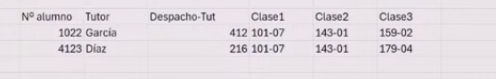

# Fundamentos de datos relacionales (SQL) y no relacionales (NoSQL)

https://www.youtube.com/live/Ggm1jShp1Eg

Instructor: Dr. Jesus Gil Dr Rudo SQL
Autor de guías oficiales: SQL Server 2012 Upgrade Technical Guide + SQL Server 2014 Upgrade Technical Guide


Temario:

1. Que es una base de datos
2. Fundamentos de bases de datos relacionales
3. Demostración: exploración de una base de datos relacional
4. Bases de datos NoSQL
5. Introducción a la normalización
6. Formas de Normalizar
    - 6.1 de la primera a la tercera forma normal
7. Demostración: Normalización de una tabla de ejemplo
8. Introducción a las sentencias de consulta


## 1. Que es una base de datos

- Almacén de datos organizado para recuperar datos
- Suelen almacenar datos de una manera que minimiza la redundancia para: almacenamiento eficiente y reducción de inconsistencias
- Los lenguajes de consulta son de forma estandarizada para acceder a los datos
- DBMS sistema de gestión de bases de datos, es el software para crear y gestionar la BD


## 2. Fundamentos de bases de datos relacionales

- La entidades se representan como relaciones (tablas), sus atributos se representan como dominios (columnas)
- deberían estar normalizadas, con relaciones definidas entre tablas a través de llaves primarias y foráneas o externas.


## 3. Demostración: exploración de una base de datos relacional


- Para generar el diagrama entidad relación:


- seleccionar todas las tablas


- Vista del diagrama entidad relación


- se pueden agregar anotaciones en el diagrama


## 4. Bases de datos NoSQL


- mejor rendimiento para volúmenes de datos
- optimizado para datos complejos


- primero al diseñar lo mas conveniente es usar bd relacionales, si el modelo de negocio lo amerita entonces usar bd no relacional, si necesita documentos, alto volumen de datos y se necesita buen rendimiento.

- **over heat** que se salga de los valores asignados de cpu, ram procesamiento

- los linux usados son suse, red hat y ubuntu


## 5. Introducción a la normalización


- es organizar los datos, tablas y relaciones para disminuir la redundancia
- la normalización aplica para BD operativas
- en su diseño la normalización buscaba optimizar el almacenamiento ya que en los 70 se disponía de poco espacio para almacenar datos, asi que la redundancia era revisada a detalle
- en **data where house** la normalización **no aplica!**


## 6. Formas de Normalizar
    - 6.1 de la primera a la tercera forma normal


- para aplicar la normalización se recomienda que los dbas deben reunirse con los desarrolladores y establecer los limites y objetivos comunes para optimizar la BD
- en el mundo real no siempre se pueden aplicar las formas de normalización
- aunque en la bd agregar una tabla para optimizar puede ser sencillo a nivel de producción puede ser mucho trabajo, sobre todo con los desarrolladores y clientes

- Primera forma normal:


- Segunda forma normal


- Tercera forma normal


## 7. Demostración: Normalización de una tabla de ejemplo

- Se tiene la siguiente tabla y es necesario Normalizarla

    

1. Forma normal 1: las tablas deben tener 2 dimensiones. ```alumno-tutor-1 sola clase``` **No tener grupos repetidos**

    

2. Forma normal 2: Elimina los datos redundantes, para poder hacerlo se crean 2 tablas **Eliminar datos redundantes**

    

3. Tercera Forma: Eliminar los datos que no dependen de la clave  **Eliminar los datos que no dependan de la llave primaria**
    - En la tabla ```Alumnos``` la sala depende del tutor, por lo que se puede generar otra tabla que contenga todos estos datos

    

- **Llave Primaria** buscar que columna(s) que evitan que tenga un problema de duplicidad de datos, no siempre es posible esto, pero puede suceder
- **Llave Foránea** es aquella columna que tiene relación pero es lave primaria de otro lado.

**Problemas de bloqueo en diseño** si una tabla tiene muchas FK cuando se está llenando ella bloquea en la transaccion las tablas independientes, si se manaja mal se pueden bloquear las tablas, llamado error por bloqueo.

## 8. Introducción a las sentencias de consulta


- T-SQL toma lo del estándar SQL pero le agrega sus condiciones para mejorar el motor de búsqueda, por ejemplo funciones propias

### Sentencia Base: **SELECT**


```sql
SELECT      OrderDate, 
            Count(OrderId)
FROM        Sales.SalesOrder
WHERE       Status = 'Shipped'
GROUP BY    OrderDate
HAVING      Count(OrderId) > 1
ORDER BY    OrderDate DESC
GO  -- se usa para separar sentencias o batches de consultas

SELECT OrderDate
FROM Sales.SalesOrder
GO
```

### Recomendaciones del Dr ¿ que se ejecuta en el query anterior primero ?

1. Al escribir una consulta, esta no se ejecuta de manera secuencial por linea, en query proceso dentro del motor de SQL primero revisa como se va a ver 
2. La primera parte que se toma es del ```FROM```
3. Se evalúa el ```WHERE```
4. Luego se ejecuta el ```GROUP BY```
5. Luego el ```HAVING```
6. Luego el ```SELECT```
7. Y finalmente el ```ORDER BY```


En internet se pueden buscar las AdventureWorks que son BD de ejemplo:

https://learn.microsoft.com/es-mx/sql/samples/adventureworks-install-configure?view=sql-server-ver16&tabs=ssms


1. Tipo **OLTP**: la operativa
2. Tipo **Data Warehouse**: Muchos datos
3. Tipo **Ligero**: Pocos datos

## Consultas NoSQL

- Se pueden consultar a través de APIs


Si se usa **CosmoDB** se puede hacer consultas con ```JSON``` o con ```SQL```, cosmoDB es una BD no relacional.

