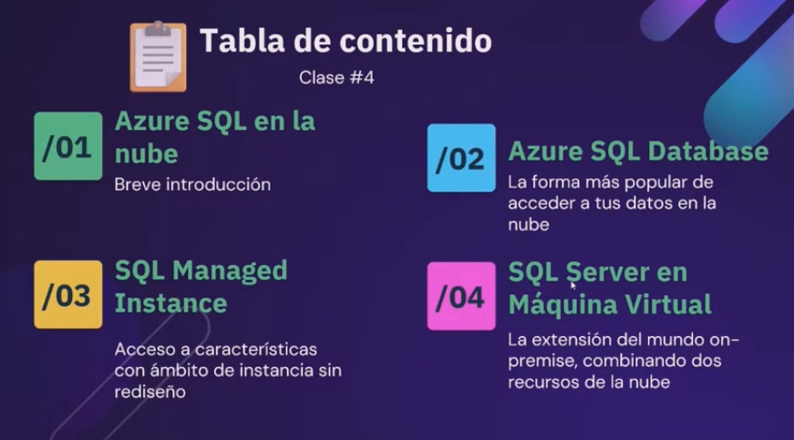
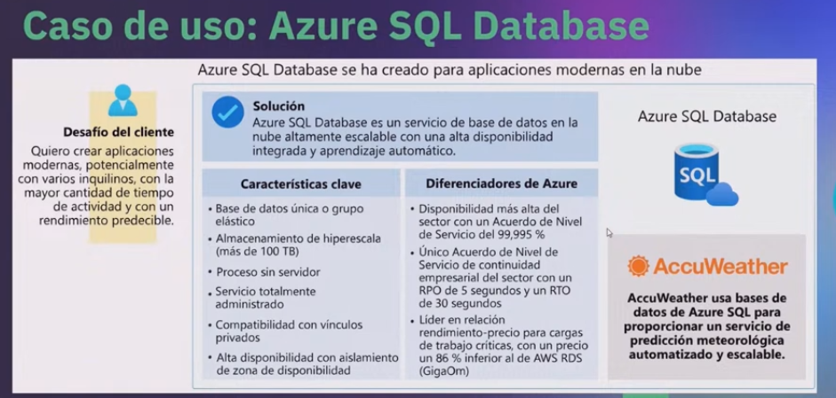
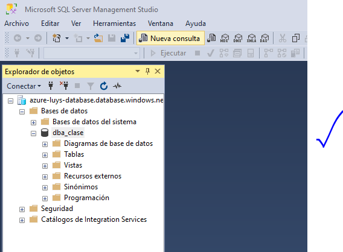
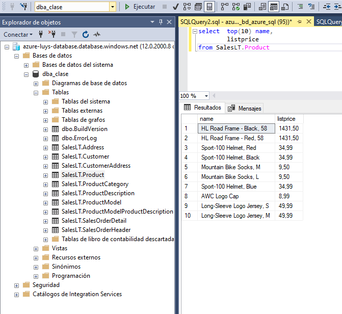
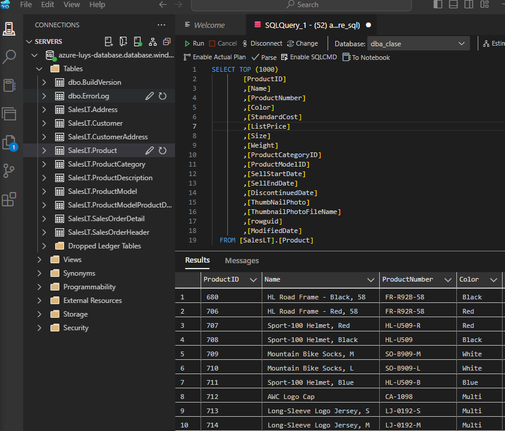

# Exploración practica de Azure

https://www.youtube.com/live/iZ4HyKfA0xQ

1. Instalar Azure data studio, https://learn.microsoft.com/en-us/azure-data-studio/download-azure-data-studio?view=sql-server-ver16&tabs=win-install%2Cwin-user-install%2Credhat-install%2Cwindows-uninstall%2Credhat-uninstall

Los pasos ya fueron descritos en el challenger modulo 1

## Objetivos

- 3 formas de usar **SQL Server Azure**

**Azure SQL**

1. Maquinas virtuales SQL, lo mejor para migraciones y aplicaciones - `IaaS`
2. Instancias Administradas, lo mejor para migraciones - `PaaS`
3. Bases de datos, lo mejor para aplicaciones en la nube, existe hyperescala y serverless `PaaS`

## Azure SQL DataBase

- PaaS, plataforma como servicio
- Simple
- Única opción que acepta base de datos ilimitados y escalado automático
- Cuenta con el SLA de mayor disponibilidad
- Accesos a funciones inteligentes de supervisión y rendimiento
- **NECESITA UN SERVIDOR**

- Ingresando con **Management Studio**

- Ejecutando una consulta

- Ahora conexión con **Azure Data Studio**

> 1:11:00

## Maquinas Virtuales

- Storage limitado al disco definido

## Instancias Administradas

- Storage limitado al definido
